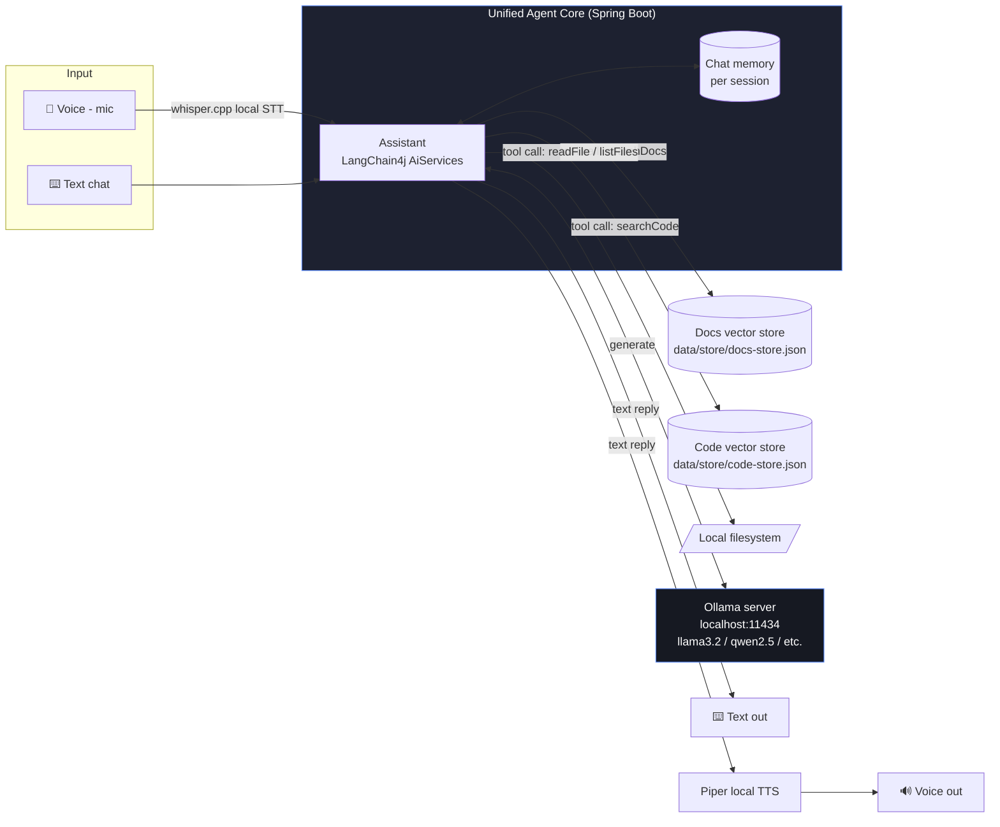

# 🖥️ Local AI Assistant

A **fully offline** Java AI assistant — chat, document Q&A (RAG), a code assistant, and voice — all
running on **one local LLM** on your own machine. No OpenAI/Anthropic/cloud API keys. No data ever
leaves localhost.

> Ask it a general question, ask it about your own PDFs/notes, ask it about a codebase, or talk to
> it out loud — it's the **same model, memory and agent loop** underneath. Only the data source
> (or the input/output medium) changes.

---

## Why this exists

Most "AI assistant" tutorials wire a Java app to a cloud API (OpenAI, Claude, Gemini). That's fine
until you care about **privacy, cost, or offline use** — e.g. assistants over confidential
documents/codebases, or environments with no internet access. This project shows the alternative:
run the model *and* the retrieval pipeline entirely on your own hardware.

## Features

| Capability | What it does |
|---|---|
| 💬 **Chat** | General-purpose conversation with per-session memory |
| 📄 **Document RAG** | Ask questions grounded in your own PDFs/notes/markdown — answers cite the source file |
| 💻 **Code assistant** | Ask questions about an ingested codebase; can read full files and list directories |
| 🎤 **Voice** | Speak your question, hear the answer spoken back — same brain, mic/speaker wrapper |
| 🔒 **100% local** | LLM via Ollama, embeddings run in-process in the JVM, vector store is a local JSON file |

---

## Architecture



**The key idea:** one LLM (served by Ollama), one `AiServices`-backed agent, one chat memory — with
a small toolbox (`searchDocs`, `searchCode`, `readFile`, `listFiles`) it calls into *only when the
question needs it*. Voice doesn't touch the agent at all — it's STT/TTS bolted onto the same
`/api/chat` logic.

### Why an in-process embedding model?

Instead of calling Ollama a second time for embeddings, this project bundles
[all-MiniLM-L6-v2](https://github.com/langchain4j/langchain4j-embeddings) as an ONNX model that
runs **inside the JVM**. One less moving part, no extra model to pull, ingestion works even before
Ollama is running.

### Why JSON-file vector stores instead of a "real" vector DB?

For a single-user local assistant, an `InMemoryEmbeddingStore` serialized to disk
(`data/store/*.json`) is simpler to set up than running Chroma/Postgres+pgvector and is plenty fast
for a few thousand chunks. Swap `EmbeddingStoreManager` for a real vector DB client if this needs
to scale further — the rest of the app (tools, ingestion, agent) doesn't change.

---

## Tech stack

- **Java 21**, **Spring Boot 4** (REST API + static web UI)
- **[LangChain4j](https://docs.langchain4j.dev/)** — tool-calling `AiServices`, chat memory, RAG plumbing
- **[Ollama](https://ollama.com)** — serves the local LLM (default: `llama3.2`)
- **all-MiniLM-L6-v2** (ONNX, in-process) — local embeddings, no server
- **Apache PDFBox** (via LangChain4j) — PDF parsing for doc ingestion
- **whisper.cpp** + **Piper** (optional, one-time setup) — fully local speech-to-text / text-to-speech

---

## Project structure

```
src/main/java/com/pankaj/localai/
├── LocalAiApplication.java        Spring Boot entry point
├── config/
│   ├── AssistantProperties.java   typed application.yml bindings
│   └── ModelConfig.java           wires the ChatModel (Ollama) + EmbeddingModel (in-process)
├── assistant/
│   ├── Assistant.java             the AiServices interface (system prompt lives here)
│   └── AssistantService.java      builds the agent: model + memory + tools
├── tools/
│   ├── DocSearchTool.java         @Tool: vector search over data/docs
│   ├── CodeSearchTool.java        @Tool: vector search over data/code
│   └── FileTools.java             @Tool: readFile / listFiles, sandboxed to the project root
├── rag/
│   ├── EmbeddingStoreManager.java load/save the two JSON vector stores
│   ├── DocumentIngestionService.java   chunk -> embed -> store, for docs
│   └── CodeIngestionService.java       chunk -> embed -> store, for code
├── voice/
│   ├── VoiceService.java          shells out to whisper.cpp / Piper
│   └── VoiceController.java       /api/voice/* endpoints
└── web/
    ├── ChatController.java        POST /api/chat
    ├── IngestController.java      POST /api/ingest/docs, /api/ingest/code
    └── HealthController.java      GET  /api/health

src/main/resources/
├── application.yml                all configuration (models, paths, voice toggle)
└── static/index.html              single-page chat UI (light/dark aware)

data/
├── docs/       <- put your PDFs/notes here (sample-notes.md included)
├── code/       <- point this at a codebase to index (or symlink your repo here)
└── store/      <- generated vector stores (git-ignored)

scripts/
├── run.sh              starts Ollama (if needed) + the app
├── pull-models.sh       pulls the configured chat model
└── setup_voice.sh       one-time build/download for whisper.cpp + Piper
```

---

## Setup

### 1. Prerequisites
- Java 21+ (`java -version`)
- Maven (or just use the included `./mvnw` wrapper — no local Maven install needed)
- [Ollama](https://ollama.com/download) installed and on your PATH
  *(no root access? see "no-root install" below — that's how this was built and tested)*

### 2. Pull the local model
```bash
ollama pull llama3.2          # ~2GB, good default for CPU-only machines
# or, for better answers if you have more RAM/CPU/patience:
# ollama pull qwen2.5:7b
# ollama pull llama3.1:8b
```
Change `assistant.ollama.chat-model` in `application.yml` if you pick a different model.

### 3. Run it
```bash
./scripts/run.sh
# or manually:
ollama serve &                # if not already running
./mvnw spring-boot:run
```
Open **http://localhost:8088** for the chat UI, or use the REST API directly (below).

### 4. Try document RAG
```bash
curl -X POST http://localhost:8088/api/ingest/docs      # indexes data/docs (sample file included)
curl -X POST http://localhost:8088/api/chat \
  -H "Content-Type: application/json" \
  -d '{"sessionId":"demo","message":"what is the secret test phrase in my notes?"}'
```

### 5. Try the code assistant
`assistant.rag.code-path` defaults to `./src/main/java` — this project's own source — so it works
immediately, no setup needed:
```bash
curl -X POST http://localhost:8088/api/ingest/code
curl -X POST http://localhost:8088/api/chat \
  -H "Content-Type: application/json" \
  -d '{"sessionId":"demo","message":"where is the chat memory configured?"}'
```
Point `assistant.rag.code-path` at any other repo to index that instead (or drop files into
`data/code/`, which is also scanned if you set the path there).

### 6. Try voice (optional, one-time setup)
```bash
./scripts/setup_voice.sh                       # builds whisper.cpp, downloads Piper + a voice
# then set assistant.voice.enabled: true in application.yml and restart
curl http://localhost:8088/api/voice/status
```

### No-root Ollama install
If you don't have `sudo`, Ollama also ships a portable Linux tarball:
```bash
mkdir -p ~/.local/ollama && cd ~/.local/ollama
wget https://github.com/ollama/ollama/releases/latest/download/ollama-linux-amd64.tar.zst
tar --zstd -xf ollama-linux-amd64.tar.zst
./bin/ollama serve &
./bin/ollama pull llama3.2
export PATH="$HOME/.local/ollama/bin:$PATH"   # add to ~/.bashrc to persist
```

---

## REST API reference

| Method | Path | Body | Description |
|---|---|---|---|
| `POST` | `/api/chat` | `{"sessionId": "...", "message": "..."}` | Ask anything — the agent picks tools as needed |
| `POST` | `/api/ingest/docs` | — | (Re)index everything in `assistant.rag.docs-path` |
| `POST` | `/api/ingest/code` | — | (Re)index everything in `assistant.rag.code-path` |
| `GET` | `/api/health` | — | Checks Ollama reachability, active model, voice status |
| `GET` | `/api/voice/status` | — | Whether whisper.cpp/Piper are installed & enabled |
| `POST` | `/api/voice/transcribe` | multipart `audio` (wav) | Speech → text |
| `POST` | `/api/voice/speak` | `{"text": "..."}` | Text → spoken wav |
| `POST` | `/api/voice/chat` | multipart `audio` + `sessionId` | Full loop: speech → answer → speech |

---

## Configuration reference (`application.yml`)

| Key | Default | Meaning |
|---|---|---|
| `assistant.ollama.base-url` | `http://localhost:11434` | Where Ollama is listening |
| `assistant.ollama.chat-model` | `llama3.2` | Which local model to use |
| `assistant.rag.docs-path` | `./data/docs` | Folder scanned for PDF/txt/md documents |
| `assistant.rag.code-path` | `./data/code` | Folder scanned for source code |
| `assistant.rag.chunk-size` / `chunk-overlap` | `500` / `50` | Text splitting for embeddings |
| `assistant.rag.max-results` / `min-score` | `5` / `0.6` | Retrieval cutoffs |
| `assistant.files.allowed-root` | `.` | Sandbox root for `readFile`/`listFiles` |
| `assistant.voice.enabled` | `false` | Turn on after running `setup_voice.sh` |

---

## Extending it
- **Swap the model**: change `assistant.ollama.chat-model` — any tool-calling-capable Ollama model works.
- **Add a new tool**: annotate a method with `@Tool("description")`, register the bean in
  `AssistantService`'s `.tools(...)` call. That's the entire contract.
- **Real vector DB**: replace `EmbeddingStoreManager`'s `InMemoryEmbeddingStore` with a
  `PgVectorEmbeddingStore` or `ChromaEmbeddingStore` (both supported by LangChain4j) if the corpus
  grows large.
- **Streaming responses**: swap `ChatModel` for `StreamingChatModel` in `ModelConfig`/`Assistant`
  for token-by-token output in the UI.

## License
MIT — do whatever you want with it.
