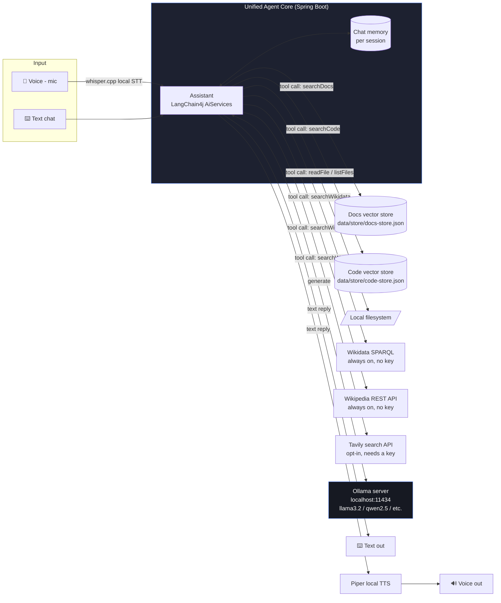

# 🖥️ Local AI Assistant

A **fully offline** Java AI assistant — chat, document Q&A (RAG), a code assistant, and voice — all
running on **one local LLM** on your own machine. No OpenAI/Anthropic/cloud API keys. No data ever
leaves localhost.

> Ask it a general question, ask it about your own PDFs/notes, ask it about a codebase, or talk to
> it out loud — it's the **same model, memory and agent loop** underneath. Only the data source
> (or the input/output medium) changes.

---

## Why this exists

Most "AI assistant" tutorials wire a Java app to a cloud API (OpenAI, Claude, Gemini). That's fine
until you care about **privacy, cost, or offline use** — e.g. assistants over confidential
documents/codebases, or environments with no internet access. This project shows the alternative:
run the model *and* the retrieval pipeline entirely on your own hardware.

## Features

| Capability | What it does |
|---|---|
| 💬 **Chat** | General-purpose conversation with per-session memory |
| 📄 **Document RAG** | Ask questions grounded in your own PDFs/notes/markdown — answers cite the source file |
| 💻 **Code assistant** | Ask questions about an ingested codebase; can read full files and list directories |
| 🌐 **Wikidata + Wikipedia** | Always-on, no API key, no account — Wikidata returns structured version numbers *with release dates* (verified returning a Kubernetes release from the same day), Wikipedia adds prose context |
| 🌦️ **Weather** | Current conditions + 2-day forecast for any city via Open-Meteo — free, no API key, no account |
| 🔍 **Live web search** | Keyless via Marginalia's public JSON API — no key, no account, works out of the box. Optional Tavily key takes priority if you set one |
| 🎤 **Voice** | Speak your question (whisper.cpp) and hear replies read aloud (Piper) — per-message 🔊 button plus an auto-speak toggle. Same brain, mic/speaker wrapper |
| 🔒 **Local-by-default** | LLM via Ollama, embeddings run in-process in the JVM, vector store is a local JSON file — Wikipedia/web-search are the only calls that leave localhost, and only when a question needs them |
| 🖌️ **Modern chat UI** | Markdown-rendered replies, auto-growing composer, animated typing indicator, suggested-prompt empty state, one-click copy — styled after ChatGPT/Claude, not a form-and-textarea demo |
| 🗂️ **Recent chats** | Sidebar list of past conversations (saved client-side); click one to resume — server-side memory is keyed by session id, so it's a real continuation, not just a replayed transcript |
| 📎 **In-chat ingestion** | All document ingestion (upload / docs folder / code folder / arbitrary path) lives behind the composer's attach menu — no separate admin panel |
| 🔀 **Live model switcher** | Header dropdown lists every model you've pulled in Ollama; switching is instant, no app restart, and conversation memory carries over |

---

## Architecture



**The key idea:** one LLM (served by Ollama), one `AiServices`-backed agent, one chat memory — with
a small toolbox (`searchDocs`, `searchCode`, `readFile`, `listFiles`, `searchWikidata`,
`searchWikipedia`, `searchWeb`)
it calls into *only when the question needs it*. Voice doesn't touch the agent at all — it's STT/TTS
bolted onto the same `/api/chat` logic.

### Why an in-process embedding model?

Instead of calling Ollama a second time for embeddings, this project bundles
[all-MiniLM-L6-v2](https://github.com/langchain4j/langchain4j-embeddings) as an ONNX model that
runs **inside the JVM**. One less moving part, no extra model to pull, ingestion works even before
Ollama is running.

### Why JSON-file vector stores instead of a "real" vector DB?

For a single-user local assistant, an `InMemoryEmbeddingStore` serialized to disk
(`data/store/*.json`) is simpler to set up than running Chroma/Postgres+pgvector and is plenty fast
for a few thousand chunks. Swap `EmbeddingStoreManager` for a real vector DB client if this needs
to scale further — the rest of the app (tools, ingestion, agent) doesn't change.

### Why does an "offline" assistant call the internet at all?

Local LLMs have a training cutoff — ask one "what's the latest LTS version of Java" and it will
confidently give you a stale or outright wrong answer, because it has no way to know its own
knowledge ends at some past date. `WikidataSearchTool`, `WikipediaSearchTool` and `WebSearchTool`
fix this the same way
a human would: look it up instead of guessing. Everything else in the app stays local; these
tools are the deliberate, clearly-labeled exception, and only `WebSearchTool` needs an API key —
the Wikidata/Wikipedia pair works with no account, key or credit card, ever.

| Tool | Setup | Coverage |
|---|---|---|
| `searchWikidata` | None — works immediately | Structured facts: version numbers with release dates (best for "latest version of X") |
| `searchWikipedia` | None — works immediately | Encyclopedic prose: definitions, history, context |
| `getWeather` | None — works immediately, no key or account | Live weather + forecast (Open-Meteo). General web search cannot do this |
| `searchWeb` → Marginalia | None — works immediately, no key or account | General web search over independent/non-commercial sites |
| `searchWeb` → Tavily | Optional [Tavily](https://app.tavily.com) API key (needs a card at signup) | Broader commercial index; used in preference to Marginalia when configured |

The `Assistant` system prompt also gets today's real date injected on every call (see
`AssistantService.chat`), so the model knows *why* its own memory might be stale instead of
asserting a wrong "latest version" with false confidence.

**A note on model choice — bigger turned out to be faster:** the intuitive assumption is that a 3B
model beats a 7B on CPU. Measured on this machine, that is wrong in practice. Raw token rate does
favour the smaller model (`llama3.2` 7.5 tok/s vs `qwen2.5:7b` 3.7 tok/s), but end-to-end, warm:

| Task | `llama3.2` (3B) | `qwen2.5:7b` |
|---|---|---|
| Greeting | 2+ min, leaked raw tool-call JSON | 3.8s, clean |
| Follow-up question | rambled about documents | 7.6s, correct recall |
| "Write Java code to add 2 numbers" | 2m 02s | 35s |

The 3B loses because it spends round-trips on tool calls it should never make — Ollama's logs showed
two model invocations for questions needing zero tools — and it emits malformed tool-call blobs as
visible prose. Prompt rules telling it not to did not stop it (it produced the artifact on 3 of 3
greetings), so `AssistantService` filters them in code and retries. Raw tokens-per-second is simply
the wrong metric: what matters is round-trips per answer.

**Two more real bugs found via actual user testing (not caught by my own test prompts):**
1. **Single-hop tool use.** Even `qwen2.5:7b`, told explicitly in the prompt to "call searchWeb, or
   searchWikipedia if searchWeb isn't configured," would call `searchWeb`, read its "not configured"
   message, and then just give up instead of making a second tool call — models are far more
   reliable at using one tool's result than at *chaining* two tool calls on their own initiative.
   Fixed by moving the fallback into code: `WebSearchTool.searchWeb()` now calls
   `WikipediaSearchTool` directly when Tavily isn't configured (or the call fails), so the fallback
   is guaranteed regardless of what the model decides.
2. **Wrong Wikipedia search endpoint.** `WikipediaSearchTool` was resolving titles via
   `action=opensearch`, which does title-*prefix* matching only. An LLM-generated query like
   `"latest Java version"` returns **zero** results from that endpoint (no article title starts with
   those words) — confirmed with a direct API call. Switched to `action=query&list=search`
   (Wikipedia's real full-text search), which correctly finds "Java version history" as the #1 hit
   for that exact phrasing.

Both are logged now (`WebSearchTool`/`WikipediaSearchTool` log every call at INFO level) specifically
so a failure like this is diagnosable from the logs instead of guesswork next time.

---

## Tech stack

- **Java 21**, **Spring Boot 4** (REST API + static web UI)
- **[LangChain4j](https://docs.langchain4j.dev/)** — tool-calling `AiServices`, chat memory, RAG plumbing
- **[Ollama](https://ollama.com)** — serves the local LLM (default: `qwen2.5:7b`; switchable live from the header dropdown)
- **all-MiniLM-L6-v2** (ONNX, in-process) — local embeddings, no server
- **Apache PDFBox** (via LangChain4j) — PDF parsing for doc ingestion
- **whisper.cpp** + **Piper** (optional, one-time setup) — fully local speech-to-text / text-to-speech

---

## Project structure

```
src/main/java/com/pankaj/localai/
├── LocalAiApplication.java        Spring Boot entry point
├── config/
│   ├── AssistantProperties.java   typed application.yml bindings
│   └── ModelConfig.java           wires the ChatModel (Ollama) + EmbeddingModel (in-process)
├── assistant/
│   ├── Assistant.java             the AiServices interface (system prompt lives here)
│   └── AssistantService.java      builds the agent: model + memory + tools
├── tools/
│   ├── DocSearchTool.java         @Tool: vector search over data/docs
│   ├── CodeSearchTool.java        @Tool: vector search over data/code
│   ├── FileTools.java             @Tool: readFile / listFiles, sandboxed to the project root
│   ├── WeatherTool.java           @Tool: current weather + forecast via Open-Meteo (no key)
│   ├── MarginaliaSearchTool.java  keyless general web search via public JSON API (plain Java HTTP)
│   ├── WikidataSearchTool.java    @Tool: always-on, no-key structured facts (version numbers + dates)
│   ├── WikipediaSearchTool.java   @Tool: always-on, no-key lookup for stable/encyclopedic facts
│   └── WebSearchTool.java         @Tool: opt-in live web search (Tavily, needs an API key)
├── rag/
│   ├── EmbeddingStoreManager.java load/save the two JSON vector stores
│   ├── DocumentIngestionService.java   chunk -> embed -> store, for docs
│   └── CodeIngestionService.java       chunk -> embed -> store, for code
├── voice/
│   ├── VoiceService.java          shells out to whisper.cpp / Piper
│   └── VoiceController.java       /api/voice/* endpoints
└── web/
    ├── ChatController.java        POST /api/chat
    ├── IngestController.java      POST /api/ingest/{docs,code,path,upload}
    ├── ModelController.java       GET /api/models, POST /api/model (live model switching)
    └── HealthController.java      GET  /api/health

src/main/resources/
├── application.yml                all configuration (models, paths, voice toggle)
└── static/index.html              chat UI: markdown rendering, avatars, auto-grow composer,
                                    typing indicator, suggested prompts, copy button (light/dark aware)

data/
├── docs/       <- put your PDFs/notes here (sample-notes.md included)
├── code/       <- point this at a codebase to index (or symlink your repo here)
└── store/      <- generated vector stores (git-ignored)

scripts/
├── run.sh              starts Ollama (if needed) + the app
├── pull-models.sh       pulls the configured chat model
└── setup_voice.sh       one-time download of prebuilt whisper.cpp + Piper binaries (no compiler needed)
```

---

## Setup

### 1. Prerequisites
- Java 21+ (`java -version`)
- Maven (or just use the included `./mvnw` wrapper — no local Maven install needed)
- [Ollama](https://ollama.com/download) installed and on your PATH
  *(no root access? see "no-root install" below — that's how this was built and tested)*

### 2. Pull the local model
```bash
ollama pull qwen2.5:7b         # ~4.7GB, default — reliable tool-calling (needed for RAG/web-search)
# or, for a much smaller/faster download on weaker machines (less reliable tool-calling):
# ollama pull llama3.2         # ~2GB, 3B
```
Change `assistant.ollama.chat-model` in `application.yml` if you pick a different model.

### 3. Run it
```bash
./scripts/run.sh
# or manually:
ollama serve &                # if not already running
./mvnw spring-boot:run
```
Open **http://localhost:8088** for the chat UI, or use the REST API directly (below).

### 4. Try document RAG
Three ways to bring documents in — not just the fixed `data/docs` folder:

- **Bulk folder scan**: `curl -X POST http://localhost:8088/api/ingest/docs` (indexes everything
  under `assistant.rag.docs-path`, sample file included)
- **📎 Attach from anywhere** (web UI): click the paperclip next to the chat box, pick any file via
  your OS's native file dialog — it's uploaded and indexed immediately, no need to copy it into the
  project folder first (this mirrors how ChatGPT/Claude attachments work)
- **Paste a path** (web UI or API): a file or folder path from *anywhere* on disk
  ```bash
  curl -X POST http://localhost:8088/api/ingest/path \
    -H "Content-Type: application/json" \
    -d '{"path": "/home/you/Documents/some-report.pdf"}'
  ```

Then ask about it:
```bash
curl -X POST http://localhost:8088/api/chat \
  -H "Content-Type: application/json" \
  -d '{"sessionId":"demo","message":"what is the secret test phrase in my notes?"}'
```

### 5. Try the code assistant
`assistant.rag.code-path` defaults to `./src/main/java` — this project's own source — so it works
immediately, no setup needed:
```bash
curl -X POST http://localhost:8088/api/ingest/code
curl -X POST http://localhost:8088/api/chat \
  -H "Content-Type: application/json" \
  -d '{"sessionId":"demo","message":"where is the chat memory configured?"}'
```
Point `assistant.rag.code-path` at any other repo to index that instead (or drop files into
`data/code/`, which is also scanned if you set the path there).

### 6. Try current-info lookup (fixes stale/wrong "latest version" answers)
`searchWikipedia` works immediately, no setup:
```bash
curl -X POST http://localhost:8088/api/chat \
  -H "Content-Type: application/json" \
  -d '{"sessionId":"demo","message":"What is the latest Java LTS version?"}'
```
Broader web search is **already on** — `MarginaliaSearchTool` calls Marginalia's public JSON API,
which needs no key, no account and no signup. Nothing to install.

**Why Marginalia and not DuckDuckGo/Google/Bing?** Those actively block programmatic access. Probed
each with a plain browser-style GET (exactly what a Java `HttpClient` does): DuckDuckGo returned an
anti-bot challenge page with **zero** result links, Mojeek an empty page, Brave HTTP 429. Getting
real results from them needs a maintained multi-engine scraper with rotation and anti-bot
workarounds — and no such library exists for Java (checked Maven Central), so it would mean owning
that cat-and-mouse game ourselves. Marginalia publishes a documented JSON endpoint instead, so a
plain `RestClient` call is enough and the stack stays 100% Java.

**Honest trade-off:** Marginalia deliberately favours independent, non-commercial sites and
down-ranks large commercial ones. For "latest version of X" its results are weaker than a mainstream
engine's — which is exactly why `searchWikidata` sits in the same chain and remains the reliable
source for version numbers.

If you'd rather use a commercial API, Tavily takes priority when configured — get a key at
[app.tavily.com](https://app.tavily.com) (note: signup asks for a card), then put it in a
**git-ignored `.env`** — *not* in
`application.yml`, which is tracked by git and would leak your key into the repo's history:
```bash
cp .env.example .env
# edit .env and paste your real key into ASSISTANT_WEBSEARCH_TAVILYAPIKEY
./scripts/run.sh          # loads .env automatically
```
`run.sh` exports those variables before starting the app, and Spring Boot's relaxed binding maps
`ASSISTANT_WEBSEARCH_TAVILYAPIKEY` onto `assistant.web-search.tavily-api-key` — so no tracked file
ever contains the secret.

If the key is missing or invalid, `searchWeb` degrades gracefully rather than erroring: it catches
the failure and falls back to `searchWikipedia`, so current-facts questions still get answered
(verified by running with a deliberately invalid key). Note: smaller local models (`llama3.2` 3B) are
noticeably less reliable at choosing to call these tools than a bigger one like `qwen2.5:7b` — see
"A note on model size and tool-calling reliability" above.

### 7. Try voice (optional, one-time setup)
```bash
./scripts/setup_voice.sh   # downloads prebuilt whisper.cpp + Piper binaries and a voice model
                           # no compiler/cmake needed - both projects ship ready-to-run Linux releases
curl http://localhost:8088/api/voice/status
```
`assistant.voice.enabled` is already `true` by default — the script just needs to have populated
`./tools/whisper` and `./tools/piper` first. Click the 🎤 button in the UI, or hit
`/api/voice/transcribe`, `/api/voice/speak`, `/api/voice/chat` directly.

### No-root Ollama install
If you don't have `sudo`, Ollama also ships a portable Linux tarball:
```bash
mkdir -p ~/.local/ollama && cd ~/.local/ollama
wget https://github.com/ollama/ollama/releases/latest/download/ollama-linux-amd64.tar.zst
tar --zstd -xf ollama-linux-amd64.tar.zst
./bin/ollama serve &
./bin/ollama pull qwen2.5:7b
export PATH="$HOME/.local/ollama/bin:$PATH"   # add to ~/.bashrc to persist
```

### CPU-only performance is genuinely slow — what actually helps
On a laptop with no dedicated GPU, expect 15-35s per response with `qwen2.5:7b`, more if the
machine is under memory pressure (check with `free -h` — swap usage is a strong signal). In order
of actual measured impact on this project:
1. **Switch to `llama3.2` (3B)** — the single biggest lever, 3-5x faster, at the cost of less
   reliable spontaneous tool-calling (see the model-size note above).
2. **Free up RAM** — close other heavy apps (IDEs, browsers with many tabs). If swap is full,
   everything on the machine slows down, not just this app.
3. **Do NOT enable the Intel iGPU here.** `OLLAMA_IGPU_ENABLE=1` looked harmless — `ollama ps`
   reported `100% GPU` — but it gave no speed benefit AND silently corrupted generation: the model
   started emitting endless `[]([]([]...` for even "what is 2+2". Switching back to CPU-only fixed
   it immediately. If you try an integrated GPU on your own hardware, validate **output quality**,
   not just latency — a speed benchmark will not catch this.

---

## REST API reference

| Method | Path | Body | Description |
|---|---|---|---|
| `POST` | `/api/chat` | `{"sessionId": "...", "message": "..."}` | Ask anything — the agent picks tools as needed |
| `POST` | `/api/ingest/docs` | — | (Re)index everything in `assistant.rag.docs-path` |
| `POST` | `/api/ingest/code` | — | (Re)index everything in `assistant.rag.code-path` |
| `POST` | `/api/ingest/path` | `{"path": "/any/file/or/folder"}` | Index a file or directory from anywhere on disk |
| `POST` | `/api/ingest/upload` | multipart `file` | Index a file handed to us directly (browser attach button) |
| `GET` | `/api/documents` | — | List indexed documents with chunk counts |
| `DELETE` | `/api/documents?name=…` | — | Remove a document from the index (chunks *and* registry entry) |
| `GET` | `/api/models` | — | List Ollama models you've pulled, plus which one is currently active |
| `POST` | `/api/model` | `{"model": "llama3.2"}` | Switch the live model — no restart, conversation memory carries over |
| `GET` | `/api/health` | — | Checks Ollama reachability, active model, voice status |
| `GET` | `/api/voice/status` | — | Whether whisper.cpp/Piper are installed & enabled |
| `POST` | `/api/voice/transcribe` | multipart `audio` (wav) | Speech → text |
| `POST` | `/api/voice/speak` | `{"text": "..."}` | Text → spoken wav |
| `POST` | `/api/voice/chat` | multipart `audio` + `sessionId` | Full loop: speech → answer → speech |

> **Why `/api/ingest/path` isn't sandboxed like `FileTools`:** `FileTools.readFile`/`listFiles` are
> called *by the LLM*, based on its own reasoning about a prompt — including prompts that might
> contain injected instructions from a retrieved document. Those stay locked to the project
> directory. `/api/ingest/path` is called *by the human* pasting a path into their own locally-running
> app — the same trust level as opening a file in a text editor. That's also why `server.address` is
> pinned to `127.0.0.1`: this endpoint would be a real problem if it were reachable from other
> devices on the network.

> **Why model switching needed a real refactor, not a config edit:** LangChain4j's `AiServices`
> bakes in the chosen `ChatModel` when it builds the proxy — there's no `setModel()` to call later.
> `AssistantService.switchModel()` rebuilds that proxy against a new `OllamaChatModel`, but keeps
> conversation memory in a map `AssistantService` owns itself (not inside the rebuilt proxy), handed
> to every rebuild via the same `chatMemoryProvider` lambda — so switching models mid-conversation
> doesn't wipe your chat history.

> **Recent chats are stored in the browser (`localStorage`), not on the server.** The server's
> memory of a conversation *is* persistent per session id for as long as the app keeps running —
> clicking a past chat just restores its rendered messages client-side and resumes with the same
> session id, so the model still remembers the earlier turns. Clearing browser storage loses the
> sidebar list, not the app's own state.

---

## Configuration reference (`application.yml`)

| Key | Default | Meaning |
|---|---|---|
| `assistant.ollama.base-url` | `http://localhost:11434` | Where Ollama is listening |
| `assistant.ollama.chat-model` | `qwen2.5:7b` | Startup model. Faster *and* better in practice than `llama3.2` — see the model note below |
| `assistant.rag.docs-path` | `./data/docs` | Folder scanned for PDF/txt/md documents |
| `assistant.rag.code-path` | `./data/code` | Folder scanned for source code |
| `assistant.rag.chunk-size` / `chunk-overlap` | `500` / `50` | Text splitting for embeddings |
| `assistant.rag.max-results` / `min-score` | `5` / `0.6` | Retrieval cutoffs |
| `assistant.files.allowed-root` | `.` | Sandbox root for the LLM's `readFile`/`listFiles` **tool calls** |
| `server.address` | `127.0.0.1` | Binds to localhost only — deliberate, since `/api/ingest/path` can read any file this OS user can access; don't widen this without adding auth |
| `assistant.web-search.enabled` | `false` | Turn on `searchWeb` (needs the key below); `searchWikipedia` always works regardless |
| `assistant.web-search.tavily-api-key` | `""` | Free key from [app.tavily.com](https://app.tavily.com) — set it via `.env` (see `.env.example`), never in this tracked file |
| `assistant.voice.enabled` | `true` | Actual availability still depends on `setup_voice.sh` having populated `./tools/whisper` + `./tools/piper` — check `/api/voice/status` |

---

## Extending it
- **Swap the model**: change `assistant.ollama.chat-model` — any tool-calling-capable Ollama model works.
- **Add a new tool**: annotate a method with `@Tool("description")`, register the bean in
  `AssistantService`'s `.tools(...)` call. That's the entire contract.
- **Real vector DB**: replace `EmbeddingStoreManager`'s `InMemoryEmbeddingStore` with a
  `PgVectorEmbeddingStore` or `ChromaEmbeddingStore` (both supported by LangChain4j) if the corpus
  grows large.
- **Streaming responses**: swap `ChatModel` for `StreamingChatModel` in `ModelConfig`/`Assistant`
  for token-by-token output in the UI.

## License
MIT — do whatever you want with it.
